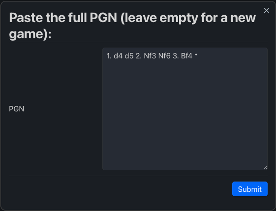
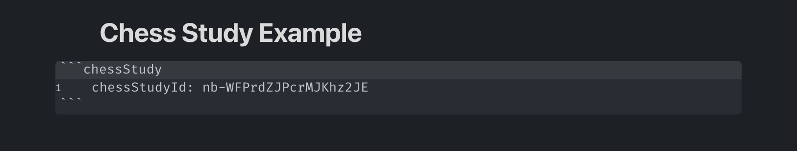
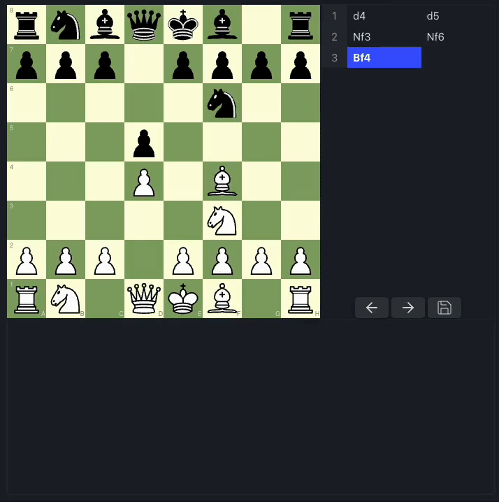

<!-- omit in toc -->

# Obsidian Chess Study

> A chess study helper and PGN viewer/editor for [Obsidian](https://obsidian.md/).

With this plugin, you can either import PGNs or simply start a fresh new game. It allows you to add comments and arrows for each move, which will be persisted within a JSON File in your vault. Although it is not a full analysis board, it serves as a valuable tool to support your chess notetaking in [Obsidian](https://obsidian.md/).

<!-- omit in toc -->

## Table of contents

- [Obsidian Chess Study](#obsidian-chess-study)
  - [Table of contents](#table-of-contents)
  - [Motivation](#motivation)
  - [Installation](#installation)
  - [Usage](#usage)
  - [Features](#features)
    - [1.0.0](#100)
    - [1.0.1](#101)
  - [Settings](#settings)
  - [Roadmap](#roadmap)
  - [Tools Used](#tools-used)
  - [Alternatives](#alternatives)
  - [License](#license)

## Motivation

I love [Obsidian](https://obsidian.md/) and its tools, but managing screenshots of chess positions is getting out of hand and is also annoying to update. It would be great to have a PGN Viewer similar to the ones offered by [lichess.org](https://lichess.org/) or [chess.com](https://chess.com/) within [Obsidian](https://obsidian.md/). It should allow us to effortlessly view PGNs, add arrows and comments, while also persisting them inside the [Obsidian](https://obsidian.md/) vault. The currently existing [alternatives](#alternatives) primarily focus on visualizing FEN snapshots, which is why this side project started.

## Installation

Once you have disabled Safe Mode, you can find third-party plugins by navigating to Settings > Community Plugins > Browse and search for "Chess Study". Once you have installed the plugin, you can access it under Settings > Community Plugins. Please note that you must enable the plugin to use it. You can also unsintall the plugin from there.

## Usage

To start, position your cursor where you want to place the PGN viewer/editor within your note. Execute the Obsidian command `Chess Study: Insert PGN-Editor at cursor position`.

This action will trigger a modal window, where you have the option to paste your PGN or leave it empty for a fresh new game. Here is what it will look like:

Once you click `Submit`, Obsidian Chess Study will parse the PGN, generate a new JSON file in your vault located at `.obsidian/plugins/obsidian-chess-study/storage/{id}.json`, and insert a chessStudy codeblock at the cursor's position. Here's an example of the chessStudy codeblock:

After that the PGN viewer/editor will render and you are good to go:

## Features

### 1.0.0

- [x] Import PGNs
- [x] Store game state in JSON
- [x] Add custom PGN viewer
- [x] Only allow legal moves
- [x] Move through the moves via navigation buttons and direct click
- [x] Draw and sync shapes
- [x] Add and sync comments with Markdown support

### 1.0.1

- [ ] Add support for variants

## Settings

Here are the available settings for a `chessStudy` code block:

| Setting            | Possible Values    | Description                                      |
| ------------------ | ------------------ | ------------------------------------------------ |
| `chessStudyId`     | Valid nanoid       | Valid ID for a file stored in the plugin storage |
| `boardOrientation` | `white` \| `black` | Orientation of the board                         |
| `boardColor`       | `green` \| `brown` | Color of the board                               |

You can permanently set some settings in the [Obsidian](https://obsidian.md/) plugin settings for Obsidian Chess Study.

## Roadmap

- [ ] Add view to manage stored games
- [ ] Add more styles
- [ ] Add more settings

## Tools Used

- Chess visuals are powered by [Chessground](https://github.com/lichess-org/chessground)
- Chess logic is powered by [Chess.js](https://github.com/jhlywa/chess.js)
- The markdown editor is powered by [TipTap](https://github.com/ueberdosis/tiptap)
- Icons are provided by [Lucide](https://github.com/lucide-icons/lucide)
- Everything is tied together by [React](https://github.com/facebook/react)

## Alternatives

If you want to have a look at FENs instead, check out these alternative Obsidian plugins:

- [SilentVoid13/Chesser](https://github.com/SilentVoid13/Chesser)
- [pmorim/obsidian-chess](https://github.com/pmorim/obsidian-chess)
- [THeK3nger/obsidian-chessboard](https://github.com/THeK3nger/obsidian-chessboard)

## License

[Obsidian Chess Study](https://github.com/chrislicodes/obsidian-chess-study) is licensed under the GPL-3.0 license. Refer to [LICENSE](https://github.com/chrislicodes/obsidian-chess-study/blob/trunk/LICENSE) for more informations.
